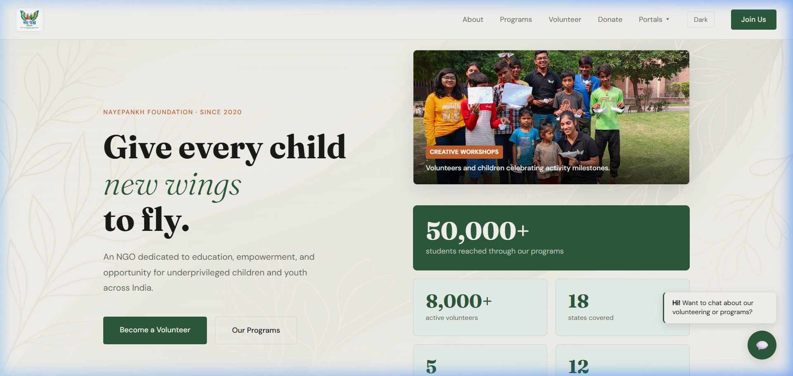
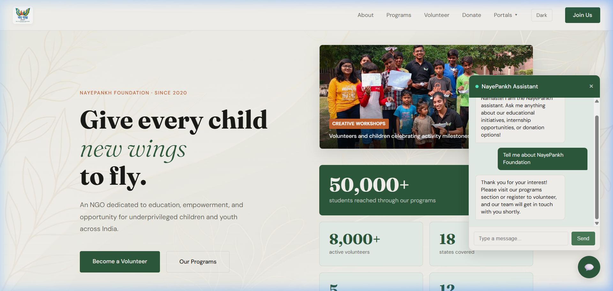
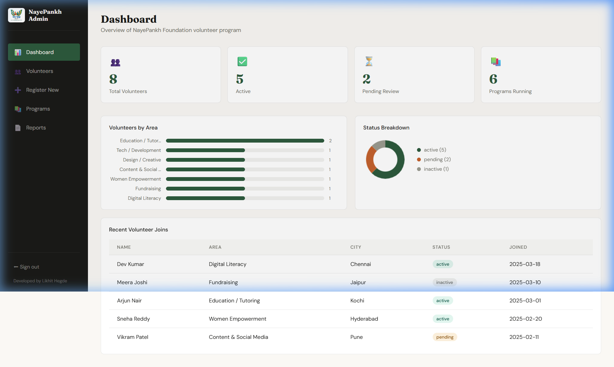
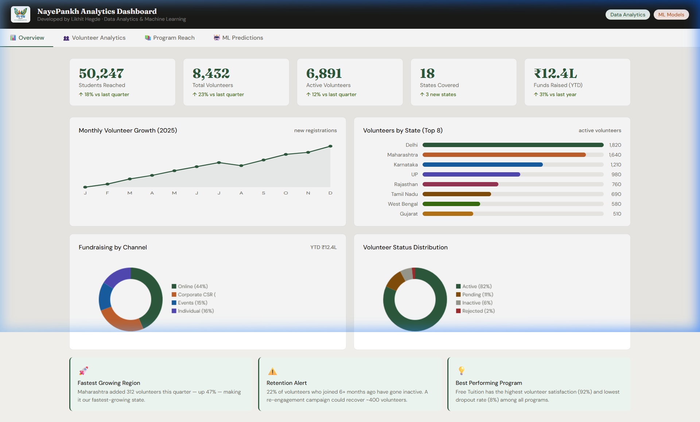
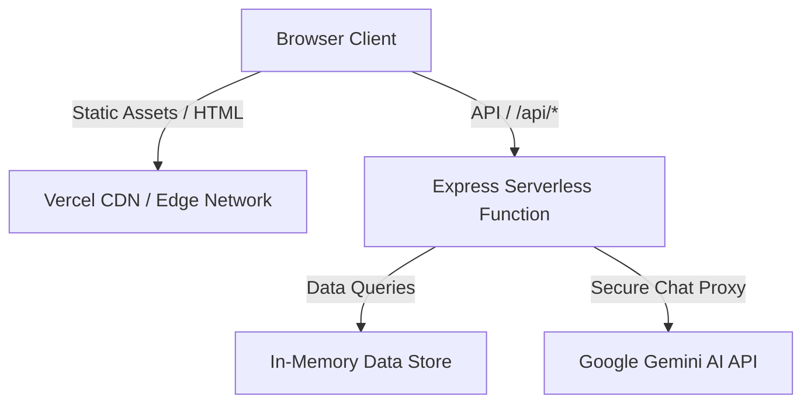

# 📑 NayePankh Foundation — Digital Portal Project Report
### 🚀 Developed by Likhit Hegde
#### *A Comprehensive Volunteer Management System & AI-Driven Analytics Platform*

---

## 📋 1. Executive Summary

This project implements a next-generation web portal and backend API for **NayePankh Foundation**, an Indian NGO dedicated to child education, women empowerment, and social welfare. The application has been fully refactored and optimized for deployment on **Vercel's serverless environment**, eliminating native database dependencies by implementing a mock in-memory database wrapper, and enabling direct request routing.

---

## 🎨 2. Core Portal Showcase

### 🏠 Main Homepage (Zero-Config CDN served)
The landing page features a premium, responsive design built with rich CSS aesthetics, clean typography (Outfit & Fraunces), custom theme toggling (Light/Dark mode), and micro-animations.



---

### 💬 Live AI Chatbot Assistant
A floating chat widget powered by Google's Gemini 2.0 API. It allows prospective volunteers to ask questions about the NGO, receive immediate answers regarding open initiatives, and learn how to get involved.



---

### 📊 Full-Stack Admin Dashboard
A secure administrative control center that enables staff to view, filter, paginate, and delete volunteer applications, as well as export data directly to CSV reports.

* **Credentials**: `admin@nayepankh.com` / `admin@123`



---

### 📈 Interactive Data Analytics Dashboard
A visual reporting dashboard showcasing active volunteer demographics, fundraising channels, regional growth trends, and machine-learning predictions.



---

## ⚙️ 3. Portal Sub-Modules (Interactive Deliverables)

The portal contains five specialized sub-portals accessible via the **Portals** dropdown in the navigation menu:

1. **💬 AI Chatbot (`/mnt/user-data/outputs/nayepankh-ai/`)**: Chat assistant with custom system prompts built for NGO inquiries.
2. **🤖 AI Screening Agents (`/mnt/user-data/outputs/nayepankh-agents/`)**: Specialized AI evaluators that review volunteer applications and score them based on fit.
3. **✨ AI Personalised Web (`/mnt/user-data/outputs/nayepankh-aiweb/`)**: Dynamic content rendering engine that alters homepage layouts based on visitor personas.
4. **📊 Full Stack Admin (`/mnt/user-data/outputs/nayepankh-fullstack/`)**: CRUD portal linked to the Node.js database endpoints.
5. **📈 Analytics Dashboard (`/mnt/user-data/outputs/nayepankh-analytics/`)**: Beautiful charts built using custom canvas elements and analytics cards.

---

## 🛠️ 4. System Architecture & Technical Stack



### 💻 Technology Details:
* **Frontend**: Vanilla HTML5, CSS3, ES6 JavaScript (Chart rendering via HTML Canvas, animations via CSS keyframes).
* **Backend**: Node.js & Express.js.
* **Database Driver**: Simulated in-memory SQL compiler mocking the `better-sqlite3` interface, removing native platform binary dependencies for serverless platforms.
* **Deployment Platform**: Vercel Serverless (configured with `vercel.json` routing rewrites).
* **Security**: JSON Web Tokens (JWT) for dashboard authorization, bcryptjs for admin credential hashing, and secure server-side API proxying to avoid exposing Gemini keys in frontend files.

---

## 🚀 5. Local Setup & Installation

Follow these steps to run the application locally on your machine:

```bash
# 1. Install dependencies
npm install

# 2. Configure Gemini API Key (Optional)
# On Windows (cmd):
set GEMINI_API_KEY=your_key_here
# On Windows (PowerShell):
$env:GEMINI_API_KEY="your_key_here"

# 3. Start the application in development mode
npm run dev
```

* **Local Address**: `http://localhost:3001`
* **API Documentation**: `http://localhost:3001/api`
